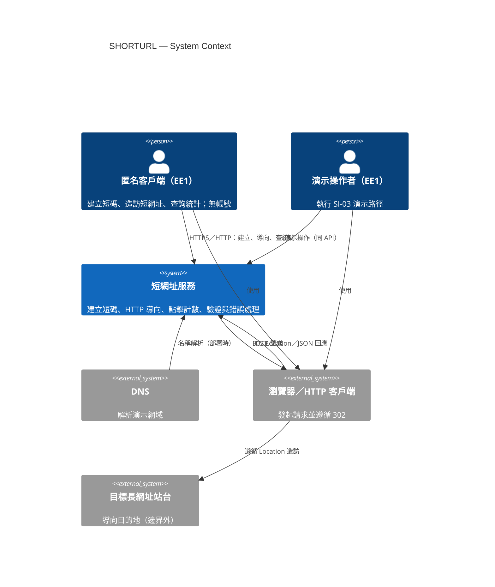

---
文件：C4 Context — 系統脈絡圖
版本：v0.1
狀態：審查中
負責角色：設計部
最後更新：2026-10-07
對應需求：REQ-001～REQ-012, NFR-002, NFR-005, SEC-001～SEC-015
專案代號：SHORTURL
---

# C4 Context：短網址服務（SHORTURL）

## 1. 系統說明

**短網址服務**是練手／小流量／無帳號 MVP：匿名客戶端可提交長網址取得短碼、以 HTTP 重新導向造訪、查詢點擊次數。無獨立 UI；演示操作者透過 HTTP 客戶端操作。對應 DFD 外部實體 **EE1**（見 `../03-data/02-dfd-v0.1.md`）。

## 2. 外部角色

| 角色 | DFD | 說明 |
|---|---|---|
| 匿名客戶端 | EE1 | 建立短碼、造訪短網址、查詢統計；無登入（OUT-03） |
| 演示操作者 | EE1（同實體） | 演示時執行 SI-03 路徑；身分等同匿名客戶端＋維運知悉 |

## 3. 外部系統

| 系統 | 說明 |
|---|---|
| DNS | 解析演示基底網域至服務入口（若採公開 URL） |
| 瀏覽器／HTTP 客戶端 | 發起請求、遵循 302 Location 導向 |

## 4. 主要互動

1. EE1 → 短網址服務：`POST /api/v1/urls` 建立短碼（REQ-001；DF-L0-01／02）
2. EE1 → 短網址服務：`GET /{shortCode}` 取得 302 導向（REQ-002／003；DF-L0-03／04）
3. EE1 → 短網址服務：`GET /api/v1/urls/{shortCode}/stats` 查點擊次數（REQ-004；DF-L0-05／06）
4. 短網址服務 → 瀏覽器：回傳 Location＝已驗證長網址（SEC-014）
5. 瀏覽器 → 目標長網址站台：遵循重新導向（系統邊界外）

## 5. C4 Context 圖



### 文字備援

```text
[匿名客戶端 EE1]──┐
                  ├──▶ [短網址服務 SHORTURL] ──302──▶ [目標長網址站台]
[演示操作者 EE1]──┘         ▲
                            │ DNS 解析
                       [DNS]
              [瀏覽器／HTTP 客戶端] 承載請求
信任邊界：TB-01（客戶端）↔ TB-02（應用）
```

## 6. 範圍邊界

| 在範圍 | 不在範圍 |
|---|---|
| 建立／導向／計數／驗證／錯誤／基本限流 | 帳號、獨立 UI、預覽頁、多區 HA、訪客 IP 明細 |

---

## 修訂紀錄

| 版本 | 日期 | 作者 | 摘要 |
|---|---|---|---|
| v0.1 | 2026-10-07 | 設計部 | G2 初稿；對齊 EE1／TB |
