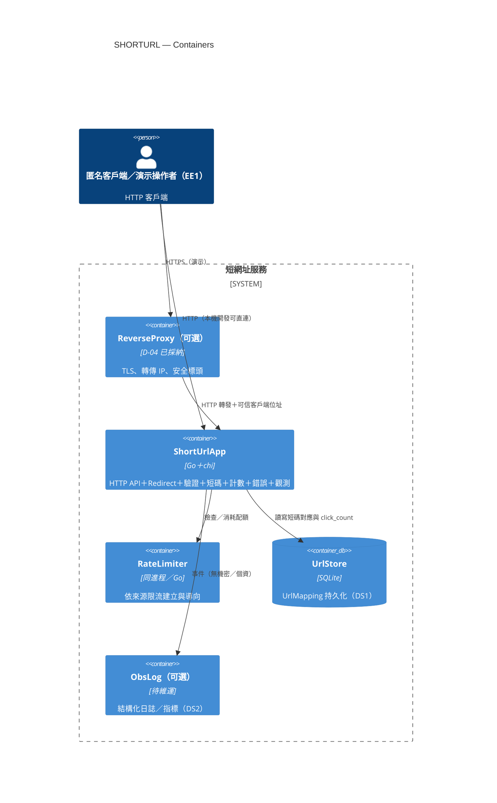

---
文件：C4 Container — 容器圖
版本：v0.1
狀態：審查中
負責角色：設計部
最後更新：2026-10-07
對應需求：REQ-001～REQ-012, NFR-001～NFR-006, SEC-007, SEC-008, SEC-012
專案代號：SHORTURL
---

# C4 Container：短網址服務

> **技術選型已定（D-04）**：ShortUrlApp＝Go＋chi；UrlStore＝SQLite。下表為邏輯容器與邊界。

## 1. 容器一覽

| 容器 | 職責 | 技術選型 | 對應 DFD | 備註 |
|---|---|---|---|---|
| **ShortUrlApp** | HTTP API＋Redirect；應用服務、驗證、短碼、錯誤對映、觀測 | **Go＋chi**（ADR-001A） | P1～P4、P6、P7（TB-02） | 單進程（NFR-003） |
| **RateLimiter** | 建立／導向速率限制 | 同進程（Go） | P5 | 建立 ≤30／分／來源；導向 ≤120／分／來源（SEC-007） |
| **UrlStore** | 持久化 UrlMapping | **SQLite 單檔**（ADR-002A） | DS1（TB-03） | 無 visitor_ip／user_agent（SEC-004）；**SEC-016／017**：參數化／原子寫入；非公網；最小權限；憑證不進版控 |
| **ReverseProxy**（可選） | TLS、轉傳客戶端位址、安全標頭 | 待維運選定（nginx／Caddy 等） | TB-01↔TB-02 邊緣 | 本機 HTTP 不宣稱 SEC-012 |
| **ObsLog**（可選） | 觀測日誌／指標 | 待維運 | DS2（TB-04） | 遮罩 Authorization／Cookie（SEC-005） |

## 2. C4 Container 圖



### 文字備援

```text
[EE1 客戶端]
    │ HTTPS（演示）／HTTP（本機）  TB-01 → TB-02
    ▼
[ReverseProxy 可選] ──▶ [ShortUrlApp] ──▶ [RateLimiter]（同進程）
                              │
                              ├──▶ [UrlStore DS1]  TB-03
                              └──▶ [ObsLog DS2]    TB-04
```

## 3. 通訊與品質屬性

| 路徑 | 協定 | 對應 NFR／SEC |
|---|---|---|
| EE1 → App／Proxy | HTTP／HTTPS | NFR-001 P95≤2s；SEC-012 演示 HTTPS |
| App → UrlStore | 進程內／本機 DB（非公網） | NFR-003；NFR-001；**SEC-016／017** |
| App → RateLimiter | 進程內 | SEC-007 |

## 4. 單實例假設（NFR-003）

MVP 單實例；RateLimiter 同進程時多實例不共享狀態——未來擴展須 CR。

## 5. UrlStore 安全約束（SEC-016／SEC-017）

- **參數化查詢**：App→DS1 唯一經 `UrlRepository`／Store；禁止拼接 SQL。
- **原子寫入**：點擊遞增為原子 UPDATE。
- **最小權限／非公網／憑證**：見 Component §5.1 與資料模型 §6；維運於 G3 以 IaC／環境文件举证。

---

## 修訂紀錄

| 版本 | 日期 | 作者 | 摘要 |
|---|---|---|---|
| v0.1 | 2026-10-07 | 設計部 | G2 初稿 |
| v0.1+D04 | 2026-10-07 | 設計部 | 對齊 D-04：Go+chi／SQLite |
| v0.1+R1 | 2026-10-07 | 設計部 | G2-QA-R1：UrlStore SEC-016／017 |
