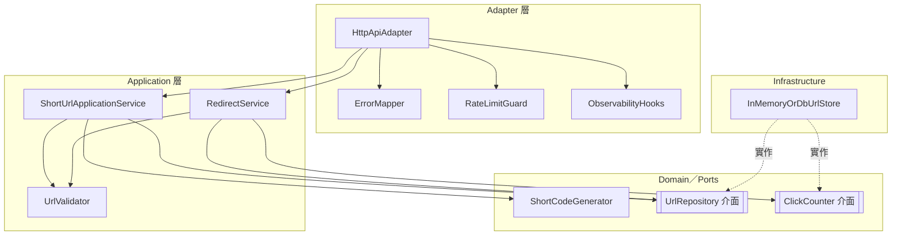

---
文件：C4 Component — 元件圖
版本：v0.1
狀態：審查中
負責角色：設計部
最後更新：2026-10-07
對應需求：REQ-001～REQ-012, NFR-001～NFR-006, SEC-001～SEC-015, SEC-016, SEC-017
專案代號：SHORTURL
補充：SEC-016, SEC-017
---

# C4 Component：ShortUrlApp 內部元件

## 1. 依賴方向（OOP／模組化）

```text
Adapter 層          →  Application 層       →  Domain／Ports  ←  Infrastructure
HttpApiAdapter         ShortUrlApplicationService    UrlRepository      InMemoryOrDbUrlStore
RateLimitGuard         RedirectService               ClickCounter
ErrorMapper            UrlValidator
ObservabilityHooks     ShortCodeGenerator
```

- **禁止循環依賴**。
- Adapter 只依賴 Application 公開介面與 ErrorMapper／RateLimitGuard。
- Application 依賴 Domain Ports（介面），不直接依賴 DB 驅動。
- Infrastructure 實作 Ports，由組裝層注入。

## 2. 元件一覽

| 元件 | 層 | 公開介面（摘要） | 對應 DFD | 對應 REQ／SEC |
|---|---|---|---|---|
| **HttpApiAdapter** | Adapter | 路由：POST /api/v1/urls、GET /{shortCode}、GET /api/v1/urls/{shortCode}/stats；HTTP↔應用 DTO | P1～P3 入口 | REQ-001～004 |
| **ShortUrlApplicationService** | Application | createShortUrl(url) → Result | P1 | REQ-001、005、007、010～012 |
| **UrlValidator** | Domain／Application | validateLongUrl(url)；validateShortCode(code) | P4 | REQ-005、006、011；SEC-001、013 |
| **ShortCodeGenerator** | Domain | generate() → short_code（CSPRNG、base62、長度 8） | P1 | REQ-006、010；SEC-006 |
| **RedirectService** | Application | redirect(shortCode) → Result\<Location, Error\>；成功時協調計數 | P2 | REQ-002、003、008；SEC-014 |
| **ClickCounter** | Port／Domain | incrementAtomic(shortCode)；getCount(shortCode) | P2／P3 | REQ-003、004 |
| **UrlRepository** | Port | save(record)；findByShortCode(code)；exists(code) | DS1 存取 | REQ-001、010、012 |
| **InMemoryOrDbUrlStore** | Infrastructure | 實作 UrlRepository＋ClickCounter（依 ADR-002） | DS1 | NFR-003 |
| **ErrorMapper** | Adapter | toHttpResponse(error) → 穩定 type／message | P6 | REQ-007～009；SEC-003 |
| **RateLimitGuard** | Adapter／Application | checkCreate(source)；checkRedirect(source) | P5 | SEC-007 |
| **ObservabilityHooks** | Adapter／Infrastructure | onCreateSuccess／Failure；onRedirectSuccess／Failure | P7 | NFR-006；SEC-005 |

## 3. Component 圖



## 4. 公開契約邊界

| 對外穩定契約 | 內部不外洩 |
|---|---|
| OpenAPI 路徑／錯誤 type | DB schema 細節、例外堆疊、框架除錯頁 |
| short_code、long_url、click_count 欄位名 | visitor_ip、user_agent（禁止存在） |
| Result／錯誤碼：invalid_url、not_found、rate_limited、internal_error | SQL 原文、檔案路徑 |

## 5. 組裝說明（D-04：Go＋chi／SQLite）

組裝根（`main`／DI）於啟動時以 SQLite 實作注入 `UrlRepository`／`ClickCounter`；`RateLimitGuard` 使用進程內計數（單實例）。HTTP 路由以 **chi** 註冊，對齊 OpenAPI 三路徑。

### 5.1 資料存取安全組裝（SEC-016／SEC-017）

| 項目 | 組裝／執行約束（可驗證） |
|---|---|
| 參數化查詢（SEC-016） | `InMemoryOrDbUrlStore` 僅透過 `database/sql`（或等價）**預先綁定參數**存取 DS1；程式碼審查禁止 `fmt.Sprintf`／字串相加組 SQL |
| 原子寫入（SEC-016） | `ClickCounter.incrementAtomic` 實作為單句原子 UPDATE（或交易內等價）；並發導向後次數與成功 302 次數一致 |
| 最小權限（SEC-017） | 應用使用專用 DB／檔案存取身分，僅業務表 CRUD；不使用超管連線跑常態請求 |
| 非公網（SEC-017） | SQLite 檔置於主機本地路徑（非網路分享給公網）；若未來改客戶端／伺服器 DB，監聽僅綁私有位址，由維運 IaC 證明 |
| 憑證（SEC-017） | 連線 DSN／密碼由環境變數或機密管理注入；禁止寫入 repo；對齊 SEC-011 掃描 |
| 欄位最小化（SEC-017） | Store 查詢投影僅 UrlMapping 業務欄位，不 `SELECT *` 擴及未定義欄 |


---

## 修訂紀錄

| 版本 | 日期 | 作者 | 摘要 |
|---|---|---|---|
| v0.1 | 2026-10-07 | 設計部 | G2 Component 必交 |
| v0.1+D04 | 2026-10-07 | 設計部 | 組裝說明對齊 D-04 Go+chi／SQLite |
| v0.1+R1 | 2026-10-07 | 設計部 | G2-QA-R1：§5.1 SEC-016／017 |
