---
文件：類別圖
版本：v0.1
狀態：審查中
負責角色：設計部
最後更新：2026-10-07
對應需求：REQ-001～REQ-012, NFR-006, SEC-001～SEC-008, SEC-013～SEC-014
專案代號：SHORTURL
---

# 類別圖：SHORTURL 公開類型

> 語言中立偽碼型別。可見性：`+` 公開、`-` 私有、`#` 保護。對應 Component 見 `03-c4-component-v0.1.md`。

## 1. Mermaid classDiagram

```mermaid
classDiagram
  direction TB

  class HttpApiAdapter {
    -appService: ShortUrlApplicationService
    -redirectService: RedirectService
    -rateLimitGuard: RateLimitGuard
    -errorMapper: ErrorMapper
    -obs: ObservabilityHooks
    +handleCreate(req: HttpRequest) HttpResponse
    +handleRedirect(req: HttpRequest) HttpResponse
    +handleStats(req: HttpRequest) HttpResponse
  }

  class ShortUrlApplicationService {
    -validator: UrlValidator
    -generator: ShortCodeGenerator
    -repo: UrlRepository
    +createShortUrl(longUrl: string) Result~UrlCreated, AppError~
    +getStats(shortCode: string) Result~UrlStats, AppError~
  }

  class RedirectService {
    -validator: UrlValidator
    -repo: UrlRepository
    -counter: ClickCounter
    +redirect(shortCode: string) Result~RedirectTarget, AppError~
  }

  class UrlValidator {
    +validateLongUrl(url: string) Result~ValidatedUrl, AppError~
    +validateShortCode(code: string) Result~string, AppError~
  }

  class ShortCodeGenerator {
    +generate() string
  }

  class UrlRepository {
    <<interface>>
    +save(record: UrlRecord) Result~void, AppError~
    +findByShortCode(code: string) Option~UrlRecord~
    +exists(code: string) boolean
  }

  class ClickCounter {
    <<interface>>
    +incrementAtomic(shortCode: string) Result~int, AppError~
    +getCount(shortCode: string) Result~int, AppError~
  }

  class InMemoryOrDbUrlStore {
    -db: StoreBackend
    +save(record: UrlRecord) Result~void, AppError~
    +findByShortCode(code: string) Option~UrlRecord~
    +exists(code: string) boolean
    +incrementAtomic(shortCode: string) Result~int, AppError~
    +getCount(shortCode: string) Result~int, AppError~
  }

  class ErrorMapper {
    +toHttpResponse(error: AppError) HttpResponse
  }

  class RateLimitGuard {
    -createLimit: int
    -redirectLimit: int
    +checkCreate(sourceId: string) Result~void, AppError~
    +checkRedirect(sourceId: string) Result~void, AppError~
  }

  class ObservabilityHooks {
    +onCreateSuccess(shortCode: string) void
    +onCreateFailure(errorType: string) void
    +onRedirectSuccess(shortCode: string) void
    +onRedirectFailure(errorType: string) void
    +onStatsSuccess(shortCode: string) void
    +onStatsFailure(errorType: string) void
  }

  class UrlRecord {
    +short_code: string
    +long_url: string
    +click_count: int
    +created_at: DateTime
  }

  class UrlCreated {
    +short_code: string
    +short_url: string
    +long_url: string
  }

  class UrlStats {
    +short_code: string
    +click_count: int
  }

  class RedirectTarget {
    +long_url: string
  }

  class AppError {
    +type: ErrorType
    +message: string
  }

  class ErrorType {
    <<enumeration>>
    invalid_url
    not_found
    rate_limited
    internal_error
  }

  HttpApiAdapter --> ShortUrlApplicationService
  HttpApiAdapter --> RedirectService
  HttpApiAdapter --> RateLimitGuard
  HttpApiAdapter --> ErrorMapper
  HttpApiAdapter --> ObservabilityHooks
  ShortUrlApplicationService --> UrlValidator
  ShortUrlApplicationService --> ShortCodeGenerator
  ShortUrlApplicationService --> UrlRepository
  RedirectService --> UrlValidator
  RedirectService --> UrlRepository
  RedirectService --> ClickCounter
  InMemoryOrDbUrlStore ..|> UrlRepository
  InMemoryOrDbUrlStore ..|> ClickCounter
  UrlRepository ..> UrlRecord
  ShortUrlApplicationService ..> UrlCreated
  ShortUrlApplicationService ..> UrlStats
  RedirectService ..> RedirectTarget
  ErrorMapper ..> AppError
  AppError --> ErrorType
```

## 2. 關聯說明

| 從 | 至 | 關係 |
|---|---|---|
| HttpApiAdapter | Application／Guard／Mapper／Obs | 組合／依賴（呼叫） |
| ShortUrlApplicationService | UrlValidator、ShortCodeGenerator、UrlRepository | 依賴 |
| RedirectService | UrlValidator、UrlRepository、ClickCounter | 依賴 |
| InMemoryOrDbUrlStore | UrlRepository、ClickCounter | 實作（Realization） |

## 3. 值物件／DTO 約束

| 類型 | 約束 |
|---|---|
| UrlRecord.short_code | `^[A-Za-z0-9]{8}$`（建議；ADR-003） |
| UrlRecord.long_url | 長度 ≤ 2048；http／https（REQ-011） |
| UrlRecord.click_count | ≥ 0 整數 |
| AppError.type | 僅四種穩定碼；message 不洩漏內部（REQ-009／SEC-003） |

---

## 修訂紀錄

| 版本 | 日期 | 作者 | 摘要 |
|---|---|---|---|
| v0.1 | 2026-10-07 | 設計部 | G2 類別圖初稿 |
