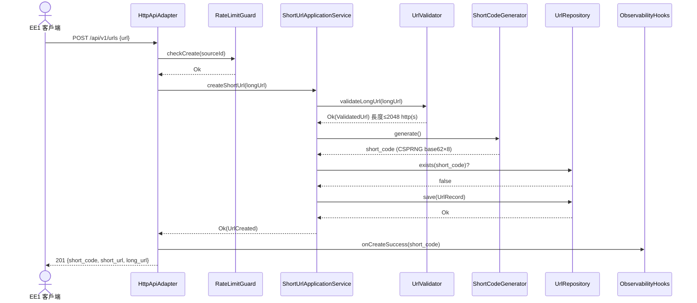
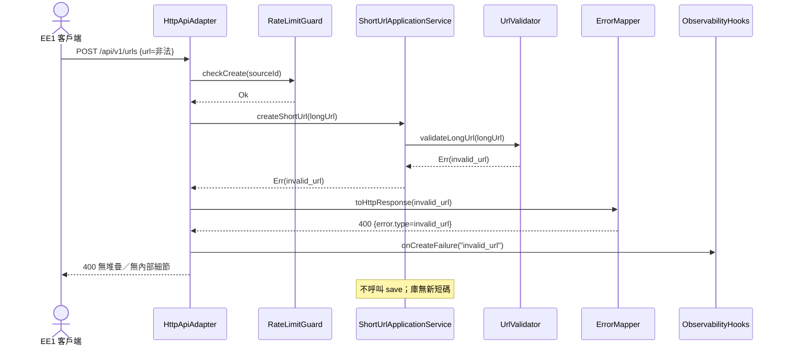
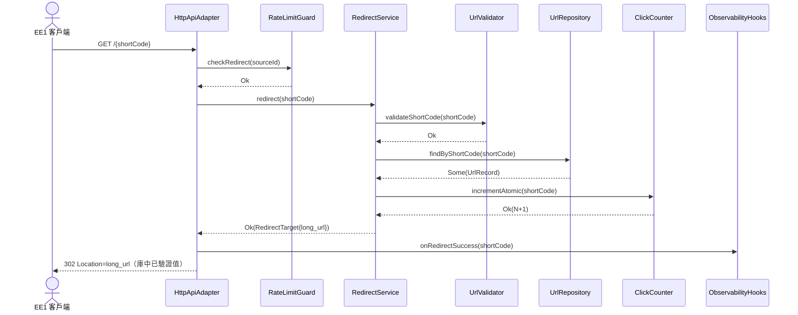
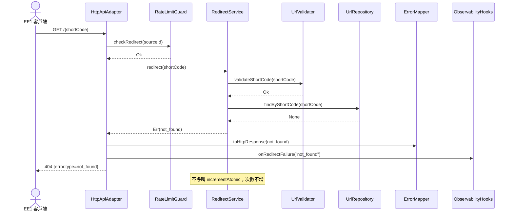
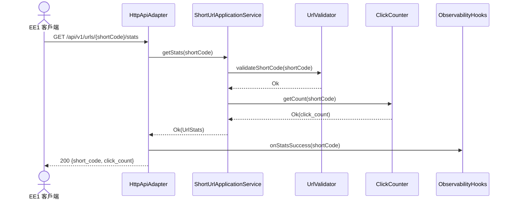
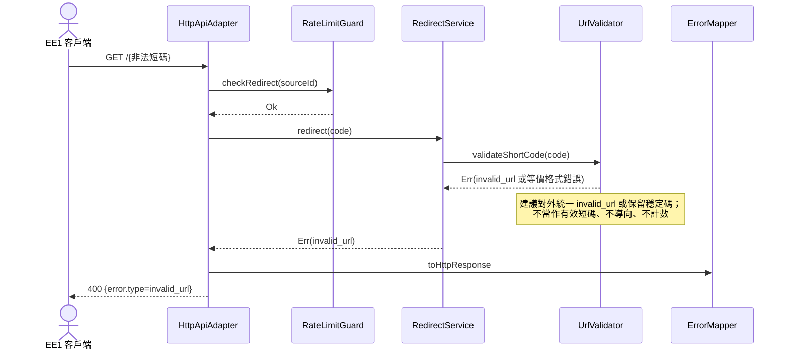
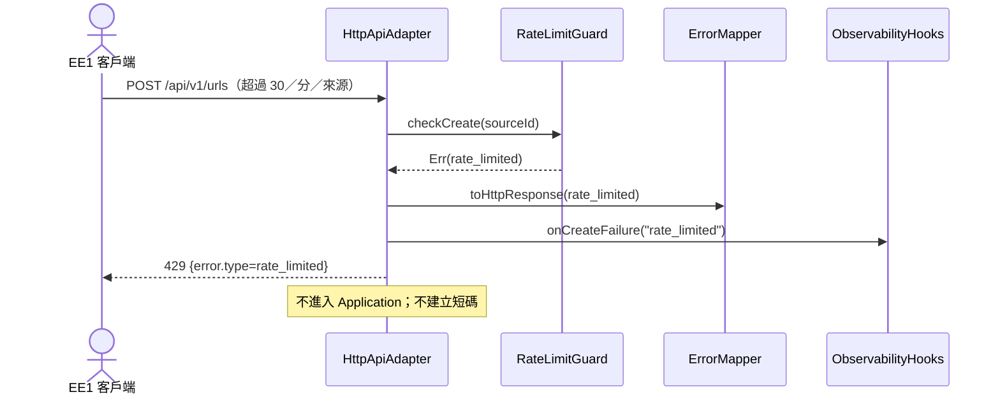

---
文件：循序圖
版本：v0.1
狀態：審查中
負責角色：設計部
最後更新：2026-10-07
對應需求：REQ-001～REQ-012, SEC-007, SEC-013
專案代號：SHORTURL
---

# 循序圖：關鍵流程

> 參與者對應 Component。錯誤碼：`invalid_url`｜`not_found`｜`rate_limited`｜`internal_error`。

---

## SEQ-01 成功建立短碼

**對應**：REQ-001、REQ-005、REQ-010、REQ-011、REQ-012；SEC-001、SEC-006

---

## SEQ-02 建立驗證失敗

**對應**：REQ-007、REQ-005、REQ-011；SEC-001

---

## SEQ-03 成功導向＋原子計數

**對應**：REQ-002、REQ-003；SEC-014

---

## SEQ-04 短碼不存在導向

**對應**：REQ-008；SEC-013

---

## SEQ-05 查詢點擊次數

**對應**：REQ-004

---

## SEQ-06 短碼格式非法

**對應**：REQ-006；SEC-013

> 實作約定：短碼格式失敗對外 `type=invalid_url`（與 OpenAPI 400 對齊）；若未來拆 `invalid_short_code` 須走 CR。查統計路徑同理。

---

## SEQ-07 速率限制觸發

**對應**：SEC-007

導向端點同理：`checkRedirect` 門檻 120／分／來源 → 429，不導向、不計數。

---

## 修訂紀錄

| 版本 | 日期 | 作者 | 摘要 |
|---|---|---|---|
| v0.1 | 2026-10-07 | 設計部 | SEQ-01～07；覆蓋主要 REQ |
