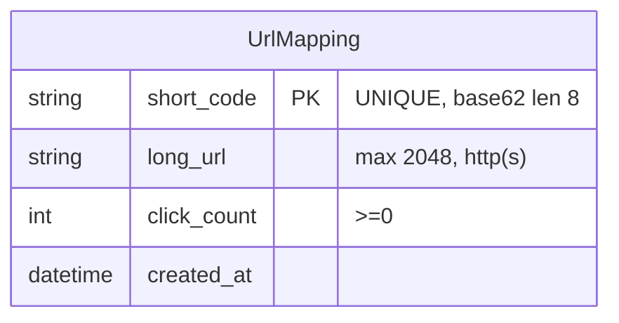

---
文件：資料模型
版本：v0.1
狀態：審查中
負責角色：設計部
最後更新：2026-10-07
對應需求：REQ-001～REQ-004, REQ-010～REQ-012, NFR-005, SEC-004, SEC-016, SEC-017
專案代號：SHORTURL
---

# 資料模型：UrlMapping

> 對應 DFD **DS1 UrlStore**（TB-03）。持久化引擎：**SQLite 單檔**（ADR-002A／D-04）。

## 1. 實體 UrlMapping

| 欄位 | 型別（邏輯） | 必填 | 約束 | 個資／敏感分級 | 說明 |
|---|---|---|---|---|---|
| id | UUID／整數（可選） | 否 | 若使用則唯一 | 非個資 | 內部代理鍵；可以 short_code 為唯一主鍵而不另設 id |
| short_code | string(8) | 是 | **PK／UNIQUE**；`^[A-Za-z0-9]{8}$`（ADR-003 建議） | 非個資 | 系統 CSPRNG 產生 |
| long_url | string | 是 | 長度 **≤ 2048**；建立時已驗證 http／https | 原則非個資；**URL 可能含識別參數**（隱私合規註記） | 導向目標 |
| click_count | integer | 是 | **≥ 0**；預設 0 | 非個資（聚合） | 成功導向時原子 +1 |
| created_at | timestamp（UTC 存、顯示轉本地） | 是 | 建立時寫入 | 非個資 | 生命週期起點 |

### 明確禁止欄位（SEC-004／NFR-005）

- **不得**存在：`visitor_ip`、`user_agent`、或其他點擊明細／訪客追蹤欄位。
- 點擊只以聚合整數 `click_count` 表示。

## 2. 約束與業務規則

| 規則 | 說明 | REQ |
|---|---|---|
| short_code 唯一 | 並發建立亦不得重複 | REQ-010 |
| 同一 long_url 可多短碼 | 不去重 | REQ-012 |
| long_url 上限 L＝2048 | 與 OpenAPI maxLength 一致 | REQ-011 |
| 無帳號外鍵 | MVP 無使用者表 | OUT-03 |

## 3. ER 圖

> 單實體；無 visitor／session 關聯表。

## 4. 生命週期（對齊隱私合規）

| 階段 | 政策 |
|---|---|
| 蒐集 | 建立者提交 long_url；系統產生 short_code／click_count |
| 保存 | 專案演示期＋結束後 30 日內（或專案終止時刪除） |
| 刪除 | 維運人工刪除對應列；無自助 API |
| 日誌 | 基礎設施日誌若含 IP：≤14 日、僅維運，**不匯入 DS1**（TB-04／DS2） |

## 5. 與 API 欄位名一致

對外 JSON／OpenAPI 使用：`short_code`、`long_url`、`click_count`（及建立回應之 `short_url` 為衍生欄，可不入庫）。

## 6. DS1 存取與部署約束（SEC-016／SEC-017）

| 約束 | 可驗證描述 | SEC |
|---|---|---|
| 參數化查詢 | 所有對 `url_mapping`（或等價表）之讀寫必須經參數綁定；禁止字串拼接 SQL | SEC-016 |
| 原子寫入 | 成功導向後 `click_count` 以單句原子 UPDATE（或等價交易）遞增；失敗路徑不寫入 | SEC-016；REQ-003 |
| 欄位最小化 | SELECT／INSERT 僅業務欄位：`short_code`、`long_url`、`click_count`、`created_at`（及可選 `id`） | SEC-017 |
| 最小權限 | 應用連線帳號僅業務表必要 CRUD；無超管／DDL 常態權限（遷移用獨立流程） | SEC-017 |
| 非公網 | DS1／SQLite 檔案或 DB 埠**不得**對網際網路公開監聽；僅本機或私有網路供 App 存取 | SEC-017 |
| 憑證處理 | 連線字串、密碼、金鑰**不進版控**；由環境變數或機密管理注入；CI 機密掃描（SEC-011）阻擋外洩 | SEC-017 |

> 品保可依本表建立檢查項／TC；實作碼審對照 `InMemoryOrDbUrlStore` 方法規格。

---

## 修訂紀錄

| 版本 | 日期 | 作者 | 摘要 |
|---|---|---|---|
| v0.1 | 2026-10-07 | 設計部 | UrlMapping；禁 IP／UA；L=2048 |
| v0.1+R1 | 2026-10-07 | 設計部 | G2-QA-R1：§6 SEC-016／017 約束 |
