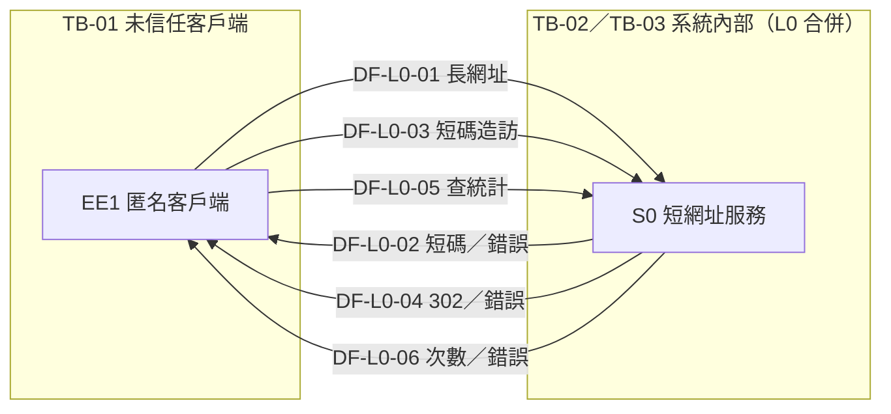
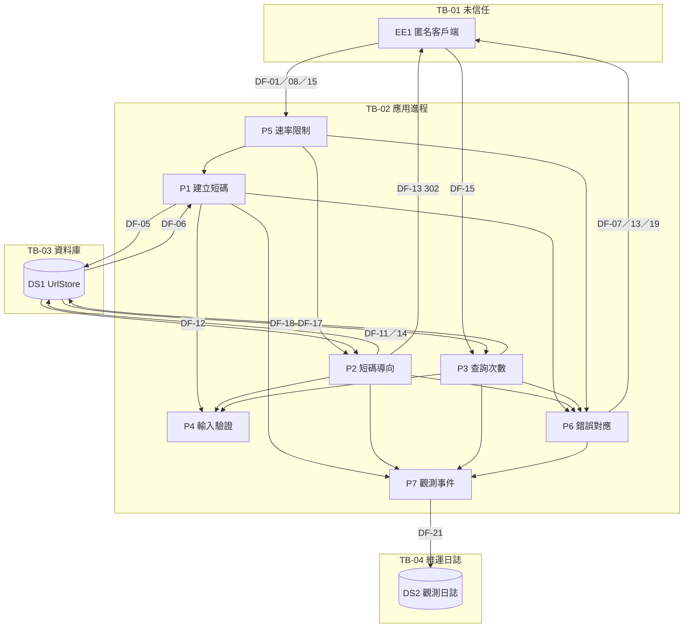

---
文件：資料流程圖（DFD）含信任邊界
版本：v0.1
狀態：審查中
負責角色：設計部
最後更新：2026-10-07
對應需求：REQ-001～REQ-012、NFR-005、NFR-006、SEC-001～SEC-015
專案代號：SHORTURL
備註：G2 定稿（元素／信任邊界編號凍結）；安全部 STRIDE 引用本路徑；變更須通知複核
---

# 資料流程圖（DFD）：短網址服務

> **定稿狀態**：信任邊界 **TB-01～TB-04** 已與安全部定案（2026-10-07）。元素編號（EE／P／DS／DF）亦凍結供 STRIDE 引用。若需變更，設計部改檔後須 ping 安全部複核。

---

## 1. 信任邊界

| 編號 | 名稱 | 說明 | 信任等級 |
|---|---|---|---|
| TB-01 | 網際網路／未信任客戶端 | 匿名瀏覽器、API 呼叫端、演示操作者；輸入不可信 | 未信任 |
| TB-02 | 應用進程信任區 | HTTP API、導向、驗證、限流、應用服務、錯誤對應 | 應用信任 |
| TB-03 | 資料庫信任區 | UrlStore（short_code／long_url／click_count／created_at） | 資料信任 |
| TB-04 | 維運日誌區 | 基礎設施／應用觀測日誌；**不得**將訪客 IP／UA 持久化為業務明細 | 維運（受限） |

跨邊界原則：
- TB-01 → TB-02：所有輸入須驗證（SEC-001、SEC-013）；限流（SEC-007）。
- TB-02 → TB-01：對外錯誤不洩漏內部細節（REQ-009、SEC-003）；導向 `Location` 僅為庫內已驗證 http(s) URL（SEC-014）。
- TB-02 → TB-03：僅經儲存庫介面；寫入欄位不含 visitor_ip／user_agent（SEC-004）。
- TB-02 → TB-04：日誌遮罩 Authorization／Cookie（SEC-005）；業務庫與日誌分離。

---

## 2. Level 0（系統情境）

### 2.1 外部實體

| 編號 | 名稱 | 說明 |
|---|---|---|
| EE1 | 匿名客戶端 | 建立短碼、造訪短網址、查詢點擊次數（無帳號） |

### 2.2 系統

| 編號 | 名稱 | 說明 |
|---|---|---|
| S0 | 短網址服務（SHORTURL） | 單一應用系統（MVP 單實例假設） |

### 2.3 資料流（L0）

| 編號 | 從 | 至 | 資料內容 | 跨邊界 |
|---|---|---|---|---|
| DF-L0-01 | EE1 | S0 | 建立請求：長網址 | TB-01→TB-02 |
| DF-L0-02 | S0 | EE1 | 建立成功：短碼、短網址；或錯誤（invalid_url／rate_limited） | TB-02→TB-01 |
| DF-L0-03 | EE1 | S0 | 造訪短網址：短碼（path） | TB-01→TB-02 |
| DF-L0-04 | S0 | EE1 | HTTP 302 Location＝長網址；或 not_found／非法短碼／限流 | TB-02→TB-01 |
| DF-L0-05 | EE1 | S0 | 查詢統計：短碼 | TB-01→TB-02 |
| DF-L0-06 | S0 | EE1 | click_count（非負整數）；或錯誤 | TB-02→TB-01 |

---

## 3. Level 1（處理分解）

### 3.1 處理（Process）

| 編號 | 名稱 | 職責 | 對應 REQ／SEC |
|---|---|---|---|
| P1 | 建立短碼 | 驗證長網址 → 產生短碼 → 持久化 → 回傳 | REQ-001、005、007、010、011、012；SEC-001、006 |
| P2 | 短碼導向 | 驗證短碼格式 → 查庫 → 302 → 原子計數 +1 | REQ-002、003、006、008；SEC-013、014 |
| P3 | 查詢點擊次數 | 驗證短碼格式 → 查庫 → 回傳 click_count | REQ-004、006、008；SEC-013 |
| P4 | 輸入驗證 | 長網址規則；短碼字元集／長度 | REQ-005、006、011；SEC-001、013 |
| P5 | 速率限制 | 依來源限制建立／導向頻率 | SEC-007 |
| P6 | 錯誤對應 | 穩定錯誤類型；不洩漏內部 | REQ-007～009；SEC-003 |
| P7 | 觀測事件 | 建立／導向成功失敗計數或日誌事件（無機密／個資） | NFR-006；SEC-005 |

### 3.2 資料儲存（Data Store）

| 編號 | 名稱 | 內容 | 信任邊界 | 禁止欄位 |
|---|---|---|---|---|
| DS1 | UrlStore | short_code（唯一）、long_url（≤2048）、click_count（≥0）、created_at | TB-03 | visitor_ip、user_agent 等點擊明細 |
| DS2 | 觀測日誌（可選／基礎設施） | 事件類型、時間、結果碼（遮罩後） | TB-04 | 完整 Authorization／Cookie；業務 IP 明細表 |

### 3.3 資料流（L1）

| 編號 | 從 | 至 | 資料內容 | 跨邊界 | 備註 |
|---|---|---|---|---|---|
| DF-01 | EE1 | P5 | 建立請求（含來源識別） | TB-01→TB-02 | 先過限流 |
| DF-02 | P5 | P1 | 通過限流之建立請求 | TB-02 內 | 超限則經 P6 回 429 |
| DF-03 | P1 | P4 | 待驗證長網址 | TB-02 內 | |
| DF-04 | P4 | P1 | 驗證結果（通過／invalid_url） | TB-02 內 | 失敗 → P6 |
| DF-05 | P1 | DS1 | 寫入 {short_code, long_url, click_count=0, created_at} | TB-02→TB-03 | CSPRNG 短碼；唯一約束 |
| DF-06 | DS1 | P1 | 寫入確認／唯一衝突重試信號 | TB-03→TB-02 | |
| DF-07 | P1 | EE1 | {short_code, short_url, long_url} 或錯誤 | TB-02→TB-01 | 經 P6 |
| DF-08 | EE1 | P5 | 造訪短碼請求 | TB-01→TB-02 | |
| DF-09 | P5 | P2 | 通過限流之造訪 | TB-02 內 | |
| DF-10 | P2 | P4 | 短碼格式檢查 | TB-02 內 | 非法 → P6（不當有效短碼） |
| DF-11 | P2 | DS1 | 依 short_code 讀取 long_url、click_count | TB-02→TB-03 | |
| DF-12 | DS1 | P2 | UrlMapping 或空 | TB-03→TB-02 | 空 → not_found |
| DF-13 | P2 | EE1 | 302 Location＝持久化 long_url | TB-02→TB-01 | 禁止依請求參數改寫（SEC-014） |
| DF-14 | P2 | DS1 | 原子 click_count = click_count + 1 | TB-02→TB-03 | 僅成功導向後 |
| DF-15 | EE1 | P3 | 查統計請求（short_code） | TB-01→TB-02 | |
| DF-16 | P3 | P4 | 短碼格式檢查 | TB-02 內 | |
| DF-17 | P3 | DS1 | 讀取 click_count | TB-02→TB-03 | |
| DF-18 | DS1 | P3 | click_count 或空 | TB-03→TB-02 | |
| DF-19 | P3 | EE1 | {short_code, click_count} 或錯誤 | TB-02→TB-01 | |
| DF-20 | P1／P2／P3／P6 | P7 | 成功／失敗事件（無機密） | TB-02 內 | |
| DF-21 | P7 | DS2 | 結構化日誌／計數指標 | TB-02→TB-04 | 遮罩敏感標頭 |

---

## 4. 與 SEC／隱私對照（供 STRIDE）

| 控制主題 | 相關流／邊界 | SEC／約束 |
|---|---|---|
| 惡意／異常輸入 | DF-01～04、P4 | SEC-001 |
| 開放重新導向／釣魚殘餘 | DF-05、DF-13；SEC-002 殘餘聲明 | SEC-002、014 |
| 資訊洩漏 | P6、DF-07／13／19 | SEC-003、REQ-009 |
| 隱私過度蒐集 | DS1 欄位集合 | SEC-004；無 IP／UA 明細 |
| 日誌洩密 | DF-21、TB-04 | SEC-005 |
| 短碼枚舉／預測 | P1→DS1 short_code | SEC-006 |
| 濫用／DoS | P5、DF-01／08 | SEC-007 |
| Location 竄改 | DF-13 | SEC-014 |
| 異常短碼 | DF-10、DF-16 | SEC-013 |

---

---

## 4.1 元素編號總表（凍結）

| 類型 | 編號清單 |
|---|---|
| 信任邊界 | TB-01、TB-02、TB-03、TB-04 |
| 外部實體 | EE1 |
| 處理 | P1、P2、P3、P4、P5、P6、P7 |
| 資料儲存 | DS1、DS2 |
| 資料流 L0 | DF-L0-01～DF-L0-06 |
| 資料流 L1 | DF-01～DF-21 |

> 安全部威脅表請使用上表編號；暫不重編。

## 5. 修訂紀錄

| 版本 | 日期 | 作者 | 摘要 |
|---|---|---|---|
| v0.1 | 2026-10-07 | 設計部 | 工作版：L0／L1、TB-01～04、流編號；供安全部 STRIDE |
| v0.1+align | 2026-10-07 | 設計部 | 安全定案 TB-01～04；E1→EE1；元素編號凍結；標定稿供 STRIDE |
